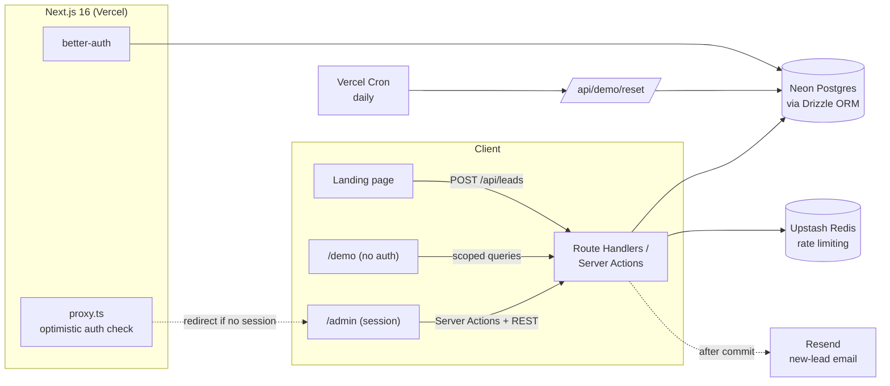
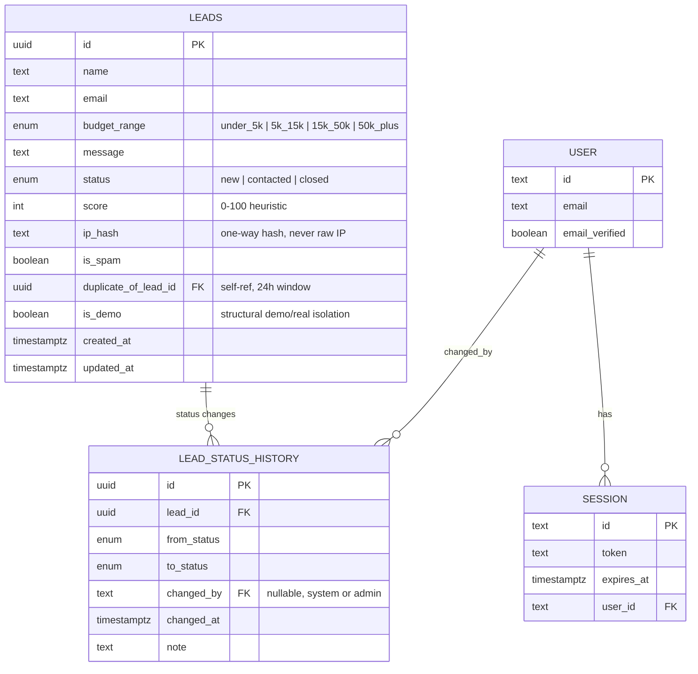
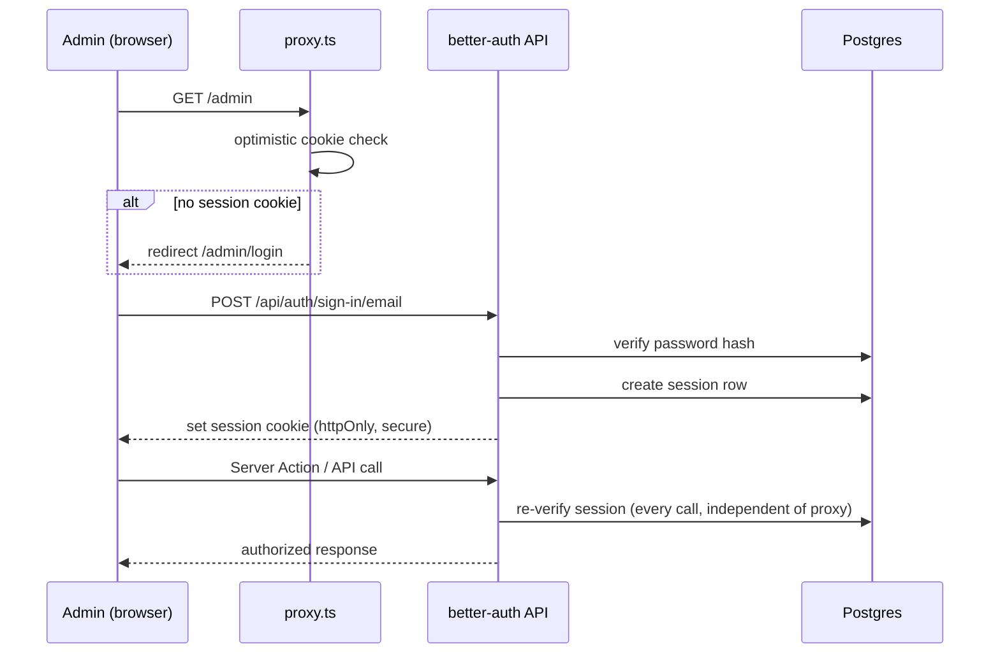
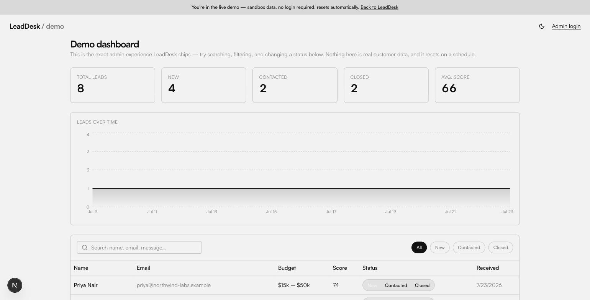
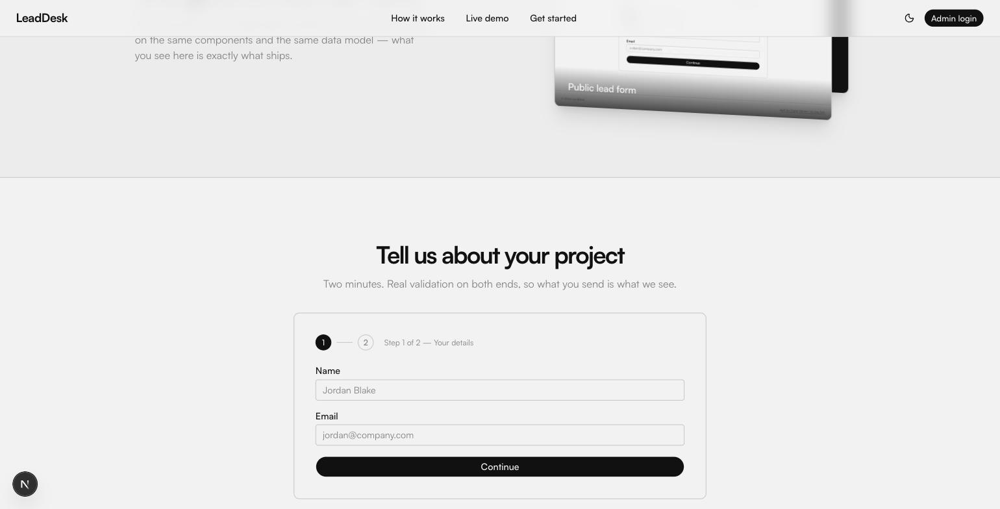

<div align="center">

<picture>
  <source media="(prefers-color-scheme: dark)" srcset="https://readme-typing-svg.demolab.com?font=Fira+Code&weight=600&size=28&pause=1200&color=F2F2F2&center=true&vCenter=true&width=600&lines=Capture+every+lead.+Miss+nothing.;Real+auth.+Real+database.+Real+audit+trail.;Built+like+a+product%2C+not+a+demo." />
  
</picture>

# LeadDesk

**A production-grade lead capture platform** — a public landing page with a validated, spam-hardened form; an admin desk with real database-backed authentication; and a public, no-login `/demo` sandbox that mirrors the real thing.

[](https://nextjs.org)
[](https://www.typescriptlang.org)
[](https://react.dev)
[](https://neon.tech)
[](https://orm.drizzle.team)
[](https://www.better-auth.com)
[](https://tailwindcss.com)
[](https://vercel.com)
[](./LICENSE)
[](../../actions)

**[Live site](https://impactlead-xx-app.vercel.app/) · [Live demo — no login](https://impactlead-xx-app.vercel.app/demo) · [Admin login](https://impactlead-xx-app.vercel.app/admin/login)**

</div>

---

## What this is

LeadDesk is a lead capture platform built to real production standards, not a scoped-down demo. It covers the full loop end to end: a validated public form, a real database, an admin view with search and status management, real authentication, and a deployment — plus a transparent lead-scoring engine, a full audit trail on every status change, layered spam defense, and a public sandbox anyone can try without an account.

Every design decision — including the ones that look flashy — traces back to a real, checkable source: the visual system is adapted from researched design patterns (see [Design system](#design-system--credits)), and every claim in this README about what works has actually been run against a live Postgres database, not assumed.

## Features

**Public side**
- Two-step lead capture form (contact details → project details) with inline validation
- Client-side validation (Zod + React Hook Form) **and** independent server-side re-validation — the server never trusts the client
- Transparent 0–100 lead score computed from budget tier, message quality, and email domain — visible to admins, not a black box
- Public `/demo` — the exact admin UI, zero login required, sandboxed data that resets on a schedule

**Admin side**
- Real database-backed sessions via better-auth — not a hardcoded password, not a JWT-only hack
- Searchable, filterable, sortable leads table with a segmented New / Contacted / Closed status control
- Full audit trail: every status change is logged with who, when, and what it changed from/to
- Live-ish dashboard (10s polling) with animated stat counters and a leads-over-time chart
- Command palette (Cmd/Ctrl+K) for fast navigation and actions
- One-click CSV export, hardened against formula-injection
- Dark mode

**Under the hood**
- Honeypot + fill-time heuristics + IP-and-email-scoped rate limiting + optional Cloudflare Turnstile — layered spam defense that degrades gracefully if any one layer isn't configured
- Duplicate-submission detection (same email within 24h)
- Transactional status updates guarded against lost-update races between concurrent admins
- CSV export sanitized against formula injection
- One-way IP hashing — raw IPs are never stored

## Architecture



## Data model



Full column-by-column rationale is in [`lib/db/schema.ts`](./lib/db/schema.ts) and [`lib/db/auth-schema.ts`](./lib/db/auth-schema.ts).

**Demo isolation is structural, not a convention.** `is_demo` lives on the same `leads` table (so `/demo` can reuse the exact real admin components), but every raw query is confined to one file — [`lib/db/queries/leads.ts`](./lib/db/queries/leads.ts) — via explicit `getRealLeads()` / `getDemoLeads()` wrappers. Demo mutations run through a separate Server Action file ([`app/actions/demo.ts`](./app/actions/demo.ts)) that hard-codes `is_demo = true` on every write, and `/demo` never touches a better-auth session at all.

## Auth flow



Public registration is hard-disabled (`disableSignUp: true`) — better-auth still mounts `POST /api/auth/sign-up/email` on its catch-all route even with no "Register" UI pointing at it, so this is verified explicitly, not assumed:

```bash
curl -X POST https://your-deploy.vercel.app/api/auth/sign-up/email \
  -H "Content-Type: application/json" \
  -d '{"email":"x@x.com","password":"password123","name":"x"}'
# → 400 { "code": "EMAIL_PASSWORD_SIGN_UP_DISABLED" }
```

The one admin account is created only by [`drizzle/seed.ts`](./drizzle/seed.ts).

## Screenshots

<table>
<tr>
<td width="50%"><br/><sub>Admin dashboard — the same UI <code>/demo</code> runs</sub></td>
<td width="50%"><br/><sub>Two-step public lead form</sub></td>
</tr>
</table>

## Tech stack

| Layer | Choice | Why |
|---|---|---|
| Framework | Next.js 16 (App Router) | Server Actions, Route Handlers, and the UI in one deploy unit |
| Language | TypeScript (strict) | |
| Styling | Tailwind CSS v4 + shadcn/ui | Re-skinned to a Swiss/brutalist token set, not default shadcn look |
| Database | Neon Postgres | Serverless Postgres, Vercel-native via Marketplace |
| ORM | Drizzle (`neon-serverless`, WebSocket) | `neon-http` doesn't support transactions — needed for the atomic status+history write in `lib/db/queries/leads.ts` |
| Auth | better-auth | Real DB-backed, revocable sessions — not a JWT-only credentials hack |
| Validation | Zod + React Hook Form | Shared schema, independently enforced client and server |
| Rate limiting | Upstash Redis (`@upstash/ratelimit`) | Sliding window, IP+email scoped |
| Email | Resend | Fire-and-forget via `after()` — a delivery failure never fails the public submission |
| Data fetching | TanStack Query | Polling over websockets — a deliberate reliability trade-off on serverless, not an oversight |
| Charts | Recharts | |
| Animation | `motion` (Framer Motion) + GSAP | |
| Testing | Vitest (unit) + Playwright (e2e) | |
| CI | GitHub Actions | Lint, typecheck, test on every push |
| Hosting | Vercel | |

## Design system & credits

The visual system — Swiss-style monochrome palette and the stacked "echo" headline effect — plus several individual animations and components are adapted from real, individually-researched design patterns rather than a generic template, including a spotlight/tilt/glow bento grid (`components/design/magic-card.tsx`) and a GSAP stacked-card cycler (`components/design/card-swap.tsx`), both re-themed from their dark/purple originals to this project's flat monochrome palette and displaying this project's own real screenshots.

## Getting started locally

```bash
git clone https://github.com/AyushCoder9/impactlead-dashboard.git
cd impactlead-dashboard
npm install
cp .env.example .env.local        # fill in at least DATABASE_URL
npm run db:push                   # push schema to your Postgres
npm run db:seed                   # seeds one admin user + demo data
npm run dev
```

Open [http://localhost:3000](http://localhost:3000). Admin login at `/admin/login` with the `SEED_ADMIN_EMAIL` / `SEED_ADMIN_PASSWORD` you set in `.env.local`. `/demo` needs no login.

### Environment variables

| Variable | Required | Where it comes from |
|---|:---:|---|
| `DATABASE_URL` | required | Neon Postgres connection string (Vercel Marketplace → Neon, or [neon.tech](https://neon.tech) directly) |
| `BETTER_AUTH_SECRET` | required | Any high-entropy random string — `node -e "console.log(require('crypto').randomBytes(32).toString('base64url'))"` |
| `BETTER_AUTH_URL` | required | Your app's own URL, e.g. `http://localhost:3000` or `https://your-app.vercel.app` |
| `NEXT_PUBLIC_APP_URL` | required | Same as above |
| `SEED_ADMIN_EMAIL` | for seeding | Any email — this becomes the one admin login |
| `SEED_ADMIN_PASSWORD` | for seeding | Any strong password |
| `KV_REST_API_URL` / `KV_REST_API_TOKEN` | recommended | Upstash Redis (Vercel Marketplace → Upstash; a standalone Upstash account instead uses `UPSTASH_REDIS_REST_URL`/`_TOKEN`, both names are supported) — rate limiting silently no-ops without these, so the app still runs without them |
| `RESEND_API_KEY` / `LEAD_NOTIFICATION_EMAIL` | optional | [resend.com](https://resend.com) — new-lead email notifications; skipped silently if unset |
| `NEXT_PUBLIC_TURNSTILE_SITE_KEY` / `TURNSTILE_SECRET_KEY` | optional | [Cloudflare Turnstile](https://developers.cloudflare.com/turnstile/) — form works fully without these, honeypot/timing/rate-limit still apply |
| `CRON_SECRET` | recommended | Any random string — protects `/api/demo/reset` from being triggered by anyone who finds the URL |

Full list with inline comments in [`.env.example`](./.env.example).

## Deployment (Vercel)

This is one Next.js app — frontend, API routes, and Server Actions all deploy together as a single unit. No separate backend deploy step.

1. **Push the repo to GitHub** (already done if you cloned this).

2. **Install the Vercel CLI and link the project** (skip if deploying via the Vercel dashboard instead):
   ```bash
   npm i -g vercel@latest
   vercel login
   vercel link
   ```

3. **Provision Postgres** — from the Vercel dashboard: **Storage → Marketplace → Neon → Add**, or via CLI:
   ```bash
   vercel integration add neon
   ```
   This auto-injects `DATABASE_URL` (and related `PG*`/`POSTGRES_*` vars) into your Vercel project — no manual copy-pasting.

4. **Provision Redis** (for rate limiting) the same way:
   ```bash
   vercel integration add upstash/upstash-kv
   ```
   This injects `KV_REST_API_URL` / `KV_REST_API_TOKEN` automatically.

5. **Set the remaining environment variables** in the Vercel dashboard (**Settings → Environment Variables**) or via CLI, for **Production**, **Preview**, and **Development**:
   ```bash
   vercel env add BETTER_AUTH_SECRET
   vercel env add BETTER_AUTH_URL          # e.g. https://your-app.vercel.app
   vercel env add NEXT_PUBLIC_APP_URL      # same value
   vercel env add SEED_ADMIN_EMAIL
   vercel env add SEED_ADMIN_PASSWORD
   vercel env add CRON_SECRET
   # optional:
   vercel env add RESEND_API_KEY
   vercel env add LEAD_NOTIFICATION_EMAIL
   vercel env add NEXT_PUBLIC_TURNSTILE_SITE_KEY
   vercel env add TURNSTILE_SECRET_KEY
   ```

6. **Deploy:**
   ```bash
   vercel --prod
   ```
   Or connect the GitHub repo in the Vercel dashboard for automatic deploys on push to `main` — build command `next build`, output is handled automatically by the Next.js framework preset (no manual build/output config needed).

7. **Push the schema and seed the admin user against production**, pointing at the same values you just set in Vercel:
   ```bash
   vercel env pull .env.local --yes --environment=production
   npm run db:push
   npm run db:seed
   ```

8. **Verify from a fresh/incognito browser**: landing page loads, form submits, `/admin` requires login, `/demo` works with zero login. The demo-reset cron (`vercel.json`) is already wired to run daily against `/api/demo/reset` automatically once deployed — Vercel's Hobby plan only allows once-per-day cron schedules, so daily is the ceiling on the free tier (Pro unlocks arbitrary schedules if you ever need faster resets).

## Testing

```bash
npm test          # Vitest — validation schemas, lead scoring, spam heuristics
npm run test:e2e  # Playwright — full happy path: submit → login → search → status change → persists
```

The e2e test needs `SEED_ADMIN_EMAIL`/`SEED_ADMIN_PASSWORD` set and a real database seeded — it's not mocked, it runs the actual flow end-to-end. CI (`.github/workflows/ci.yml`) runs lint, typecheck, and the unit suite on every push.

## Project structure

```
app/
  (public)/page.tsx          landing page
  demo/                      public, no-login sandbox
  admin/(protected)/         session-gated dashboard
  admin/login/               better-auth login form
  api/leads/                 public POST + admin GET/export/stats
  api/demo/                  demo-scoped reads + cron reset
  api/auth/[...all]/         better-auth catch-all
  actions/leads.ts           real admin Server Actions (session-checked)
  actions/demo.ts            demo-only Server Actions (hardcoded is_demo)
components/
  ui/                        shadcn primitives, re-skinned
  design/                    echo-headline, magic-card, card-swap, etc.
  forms/                     lead form, submit button
  admin/                     leads table, stat tiles, command palette
lib/
  db/                        schema, lazy client, the one queries file
  auth.ts                    better-auth server config
  validation/                shared Zod schemas
  spam/                      honeypot, duplicate detection, scoring
proxy.ts                     Next.js 16's renamed middleware.ts
drizzle/                     migrations + seed script
tests/                       unit (Vitest) + e2e (Playwright)
```

## AI usage

<!-- TODO: one paragraph on where AI was used in building this and what was changed/verified afterward, per the brief's rules. -->

## Assumptions

- Email+password admin auth rather than OAuth/SSO — satisfies "not a hardcoded string, sessions/tokens handled properly" without a third-party dependency an evaluator would need to configure.
- 10-second polling rather than websockets for "live" admin updates — a deliberate reliability trade-off on a serverless free tier, documented as a choice, not a gap.
- Turnstile is optional/progressive so the repo runs for an evaluator with zero extra API keys beyond a database.
- No public sign-up for admin accounts by design — the one admin account is seeded, matching a real "internal tool" access model.

## License

MIT — see [`LICENSE`](./LICENSE).
